# 🏛️ System Architecture & Data Flow

**Course:** Advanced Data Structures and Algorithm (ADSA)  
**Project:** Online Collaborative Whiteboard  

This document outlines the complete end-to-end data flow for the core interactions within the whiteboard system.

---

## 1. The "Draw a Stroke" Data Flow

When **User A** presses their mouse and moves it across the canvas, a sequence of coordinate points is generated.

```mermaid
sequenceDiagram
    participant A as User A's Browser
    participant S as Socket.io Server (Node.js)

    Note over A: 1. Listen for onMouseMove
    A->>A: 2. Capture (x, y) coordinates
    A->>A: 3. Render stroke locally on Canvas
    
    rect rgb(30, 41, 59)
    A->>S: 4. Emit "draw_stroke" event
    Note right of A: Payload: { startX, startY, endX, endY, color, width, roomId }
    end
```



---

## 2. Backend Processing (The EventQueue)

The Node.js backend receives concurrent drawing events from all users. To guarantee that every user's screen looks exactly the same, the server acts as the single source of truth and enforces a strict chronological order.

```mermaid
sequenceDiagram
    participant Clients as Active Users
    participant S as Server
    participant Q as EventQueue (FIFO)

    Clients->>S: Emit "draw_stroke"
    S->>Q: Enqueue Event (Rear)
    Note right of Q: [A, B, C] -> wait for loop
    
    rect rgb(30, 41, 59)
    S->>Q: Process Loop (Dequeue Front)
    Q-->>S: Returns oldest Event
    S->>Clients: Broadcast "receive_stroke"
    end
    
    Note over S: Event garbage collected from memory
```



> [!NOTE]  
> The server stores the event temporarily in the queue just long enough to process it. Once broadcasted, the server removes it from the queue, preventing memory leaks.

---

## 3. Receiving and Rendering (User B)

Meanwhile, **User B** sits in the same room. Their client listens for incoming socket events broadcasted by the server.

```mermaid
sequenceDiagram
    participant S as Socket.io Server
    participant B as User B's Browser
    participant C as HTML5 Canvas

    S->>B: Broadcast "receive_stroke"
    B->>B: 1. Extract coordinates & style
    
    rect rgb(30, 41, 59)
    B->>C: 2. context.lineTo(endX, endY)
    B->>C: 3. context.stroke()
    end
    
    Note over C: Screen natively updates to show User A's line
```



---

## 4. The Undo Operation (UndoStack)

What happens when **User A** makes a mistake and clicks `Undo`? We rely on our **LIFO Stack**.

```mermaid
sequenceDiagram
    participant A as User A
    participant Stack as UndoStack (LIFO)
    participant C as User A Canvas
    participant S as Node.js Server
    participant B as User B & C

    A->>A: Clicks "Undo"
    A->>Stack: Check isEmpty()
    Stack-->>A: false (has items)
    
    A->>Stack: UndoStack.pop()
    Stack-->>A: Popped User A's Stroke
    
    A->>C: Clear Canvas
    A->>C: Redraw remaining stack contents
    
    rect rgb(30, 41, 59)
    A->>S: Emit "undo_action"<br/>{ userId, roomId }
    S->>B: Broadcast "undo_action"
    Note over B: B & C remove User A's stroke and redraw
    end
```



---

## 5. The DSA Dashboard Data Lifecycle

As part of the ADSA project requirements, we expose the health and metrics of our underlying data structures.

**What the dashboard displays:**
1. **Queue Length (Live):** How many draw events are currently pending in the FIFO EventQueue.
2. **Current Queue Head:** A snapshot of the `.peek()` value.
3. **Stack Sizes:** The current depth of the local Undo/Redo Stacks.

**Where it gets data from:**
The dashboard relies on both local state (React) and a WebSocket stream from the Node.js server.

```mermaid
graph TD
    subgraph ServerNode ["Node.js Server"]
        Q[EventQueue (FIFO)]
        MetricLoop((setInterval 500ms))
        
        Q -.->|queue.length| MetricLoop
        MetricLoop -->|emit "dsa_metrics"| Socket
    end

    subgraph ClientReact ["React Frontend"]
        Socket -->|listen "dsa_metrics"| Dashboard[DSA Dashboard]
        
        U[UndoStack Array] -.->|length| Dashboard
    end

    style Dashboard fill:#4f46e5,stroke:#c7d2fe,stroke-width:2px,color:#fff
    style Q fill:#1f2937,stroke:#3b82f6,color:#fff
```
