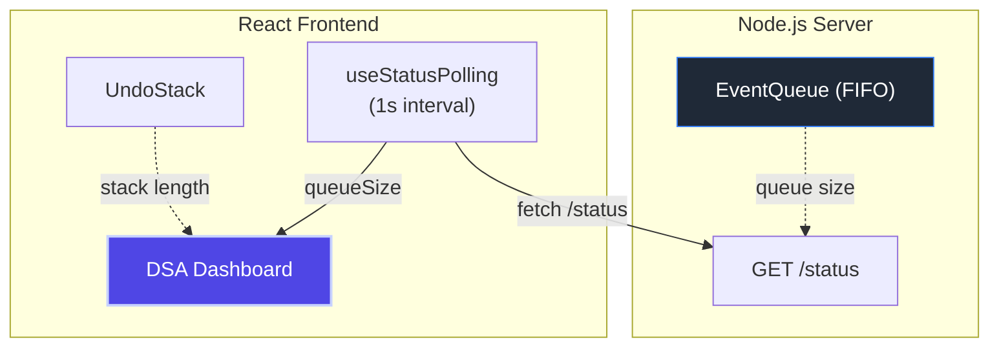
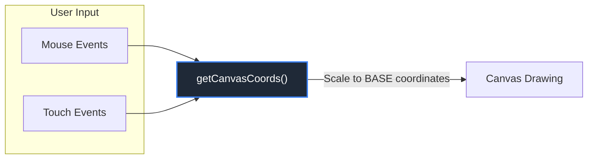

# System Architecture & Data Flow

**Course:** Advanced Data Structures and Algorithm (ADSA)
**Project:** Online Collaborative Whiteboard

This document outlines the complete end-to-end data flow for the core interactions within the whiteboard system.

---

## 1. The "Draw a Stroke" Data Flow

When **User A** presses their mouse (or touches the screen) and moves across the canvas, a sequence of coordinate points is generated.

```mermaid
sequenceDiagram
    participant A as User A
    participant S as Node Server

    Note over A: 1. Listen for onMouseMove / onTouchMove
    A->>A: 2. Capture (x, y) coordinates
    A->>A: 3. Render stroke locally on Canvas

    rect rgb(30, 41, 59)
    A->>S: 4. Emit "draw" event
    Note right of A: Payload: { strokeId, startX, startY, endX, endY, color, width }
    end
```

---

## 2. Backend Processing (The EventQueue)

The Node.js backend receives concurrent drawing events from all users. To guarantee that every user's screen looks exactly the same, the server acts as the single source of truth and enforces a strict chronological order.

```mermaid
sequenceDiagram
    participant Clients as Active Users
    participant S as Server
    participant Q as EventQueue

    Clients->>S: Emit "draw"
    S->>Q: Enqueue Event (Rear)
    Note right of Q: [A, B, C] -> wait for loop

    rect rgb(30, 41, 59)
    Note over S: setInterval(~16ms / 60fps)
    S->>Q: Dequeue Front
    Q-->>S: Returns oldest Event
    S->>Clients: socket.broadcast.emit("draw")
    end

    Note over S: Event garbage collected from memory
```

> The server stores the event temporarily in the queue just long enough to process it. Once broadcast, the server removes it from the queue, preventing memory leaks.

---

## 3. Receiving and Rendering (User B)

Meanwhile, **User B** is also connected. Their client listens for incoming socket events broadcast by the server.

```mermaid
sequenceDiagram
    participant S as Socket Server
    participant B as User B
    participant C as Canvas

    S->>B: Broadcast "draw"
    B->>B: 1. Extract coordinates & style

    rect rgb(30, 41, 59)
    B->>C: 2. drawLineSegment(startX, startY, endX, endY, color, width)
    end

    Note over C: Screen updates to show User A's line
```

---

## 4. The Undo Operation (UndoStack)

What happens when **User A** makes a mistake and clicks `Undo`? We rely on our **LIFO Stack**.

```mermaid
sequenceDiagram
    participant A as User A
    participant Stack as UndoStack
    participant C as Local Canvas
    participant S as Node Server
    participant B as Other Users

    A->>A: Clicks "Undo" (or Ctrl+Z)
    A->>Stack: Check isEmpty()
    Stack-->>A: false (has items)

    A->>Stack: pop()
    Stack-->>A: Popped Stroke ID

    A->>C: Filter out matching strokeId segments
    A->>C: Clear Canvas & redraw remaining strokes

    rect rgb(30, 41, 59)
    A->>S: Emit "undo" { userId, targetStrokeId }
    S->>B: Broadcast "undo"
    Note over B: Remove matching strokeId segments & redraw
    end
```

---

## 5. The DSA Dashboard Data Lifecycle

As part of the ADSA project requirements, we expose the health and metrics of our underlying data structures.

**What the dashboard displays:**
1. **Queue Length (Live):** How many draw events are currently pending in the FIFO EventQueue.
2. **Stack Size:** The current depth of the local UndoStack.

**Where it gets data from:**
- **Queue size:** Polled every 1 second via `GET /status` REST endpoint from the React frontend (`useStatusPolling` hook).
- **Stack size:** Read directly from the local `UndoStack` instance inside the Canvas component.

---

## 6. Mobile & Touch Data Flow

The canvas supports both mouse and touch input through a unified coordinate mapping system.

**Key details:**
- `getCanvasCoords()` normalizes both mouse and touch events into the same coordinate space by scaling `clientX`/`clientY` relative to the canvas `getBoundingClientRect()`
- Canvas internal resolution is fixed at `1000x600` (scaled by `devicePixelRatio`), but the display size adapts to the viewport
- `touch-action: none` on the canvas prevents the browser from intercepting gestures for scrolling or zooming
