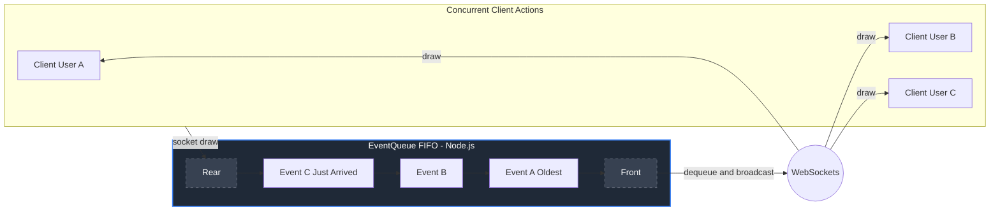
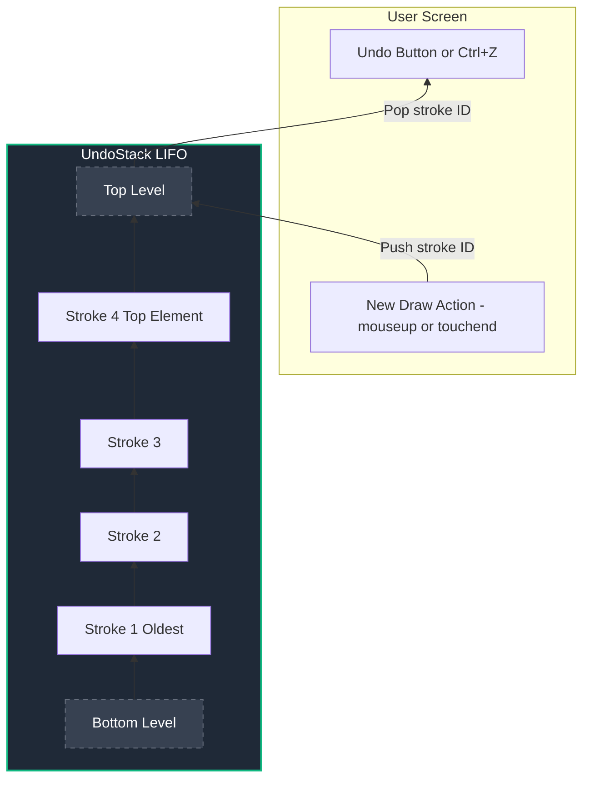

# Data Structures Design Document

**Course:** Advanced Data Structures and Algorithm (ADSA)
**Project:** Online Collaborative Whiteboard

---

## 1. EventQueue (Backend Event Handling)

### What it is
A **Queue** is a linear data structure that follows the **First-In-First-Out (FIFO)** principle. Elements are inserted at the rear (enqueue) and removed from the front (dequeue). Think of it like a line of people waiting to buy movie tickets — the first person in line is the first person served.

### Why it is the correct choice
In a real-time collaborative system, multiple users are sending drawing events (mouse moves, touches) concurrently to the server. To maintain exact consistency across all clients, the server must process and broadcast these events in the **exact chronological order** they arrived. A Queue guarantees that an older event is always broadcast before a newer one, preserving the natural continuous flow of a drawn line.

### Internal Structure (Mermaid Diagram)

### Implementation Details

The queue is implemented using a plain JavaScript object with integer-based `head` and `tail` pointers, rather than an array. This avoids the O(N) cost of `Array.shift()` — both `enqueue` and `dequeue` are true O(1) operations.

A `setInterval` worker loop runs every ~16ms (matching 60fps display refresh rate), dequeuing one event per tick and broadcasting it to all other connected clients.

### Required Operations & Time Complexities

| Operation | Description | Time Complexity |
|-----------|-------------|-----------------|
| `enqueue(event)` | Adds a new drawing event to the rear of the queue | **O(1)** |
| `dequeue()` | Removes and returns the oldest event from the front | **O(1)** |
| `peek()` | Inspects the oldest event without removing it | **O(1)** |
| `isEmpty()` | Checks if there are pending events | **O(1)** |
| `size()` | Returns current number of pending events (`tail - head`) | **O(1)** |
| `toArray()` | Returns all items in FIFO order for dashboard display | **O(N)** |

### What would go wrong if we used the wrong data structure?

> If we used a **Stack (LIFO)** instead of a Queue, the server would broadcast the *most recently* received event first. If a user quickly drew a line from point A to B to C, the events might arrive as A, B, C but be processed as C, B, A. Every user would see the line drawing itself backwards, creating chaotic and disconnected strokes on the canvas!

---

## 2. UndoStack (Frontend History Management)

### What it is
A **Stack** is a linear data structure that follows the **Last-In-First-Out (LIFO)** principle. Elements are added to the top (push) and removed from the top (pop). Think of it like a stack of cafeteria plates — you always take the top plate off, which was the last one put down.

### Why it is the correct choice
When a user presses "Undo" (`Ctrl+Z` or the Undo button), they expect to erase the very **last** thing they just drew. A Stack structurally enforces chronological rollback. Every time a user completes a stroke, its unique ID is pushed onto the top of the Stack. When they undo, we simply pop the top stroke ID, remove all matching segments from the global tracking array, and redraw the canvas.

### Internal Structure (Mermaid Diagram)

### Implementation Details

The stack is backed by a native JavaScript array, where `push()` and `pop()` are naturally O(1). Each completed stroke (on `mouseup` or `touchend`) pushes a unique `strokeId` onto the stack. On undo, `pop()` returns the most recent strokeId, all segments matching that ID are filtered out from the global tracking array, and the canvas is redrawn from scratch with the remaining segments.

### Required Operations & Time Complexities

| Operation | Description | Time Complexity |
|-----------|-------------|-----------------|
| `push(strokeId)` | Saves a completed stroke ID to the top of the history stack | **O(1)** |
| `pop()` | Removes and returns the most recent stroke ID to undo it | **O(1)** |
| `peek()` | Looks at the most recent action to determine UI state | **O(1)** |
| `isEmpty()` | Checks if undo state is empty (disables the Undo button) | **O(1)** |
| `size()` | Returns current stack depth for the dashboard display | **O(1)** |
| `toArray()` | Returns all items in stack order for dashboard display | **O(N)** |

### What would go wrong if we used the wrong data structure?

> If we used a **Queue (FIFO)** instead of a Stack for history, pressing `Ctrl+Z` would delete the very **first thing** you ever drew on the canvas! If you spent an hour drawing a masterpiece and made one tiny mistake at the end, pressing Undo would suddenly wipe out the foundational sketch you did 60 minutes ago, while the mistake remained untouched.
